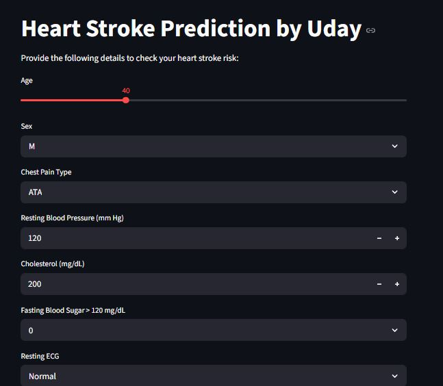

# Heart Disease Prediction using Machine Learning

## Overview
This project predicts the likelihood of heart disease using Machine Learning techniques and a trained KNN classification model.

The application is built using Streamlit and provides an interactive user interface for real-time predictions.

---

## Features
- Interactive Streamlit web application
- Real-time heart disease prediction
- KNN Machine Learning model
- Data preprocessing and scaling
- Clean and user-friendly UI

---

## Tech Stack
- Python
- Streamlit
- Pandas
- NumPy
- Scikit-learn
- Joblib

---

## Machine Learning Workflow
1. Data Collection
2. Data Cleaning
3. Exploratory Data Analysis (EDA)
4. Feature Encoding
5. Feature Scaling
6. Model Training
7. Prediction System Development

---

## Model Used
- K-Nearest Neighbors (KNN)

---

## Project Structure

```text
heart-disease-prediction-ml/
│
├── app.py
├── Heart.ipynb
├── heart.csv
├── requirements.txt
├── README.md
├── .gitignore
│
├── models/
│   ├── KNN_heart.pkl
│   ├── scaler.pkl
│   └── columns.pkl
│
└── screenshots/
    └── app-ui.JPG
```

---

## Application Screenshot



---

## Run Locally

Clone the repository:

```bash
git clone https://github.com/yourusername/heart-disease-prediction-ml.git
```

Install dependencies:

```bash
pip install -r requirements.txt
```

Run the application:

```bash
streamlit run app.py
```

---

## Future Improvements
- Deploy the application online
- Add more ML models
- Improve UI/UX
- Add model comparison

---

## Author
Uday Jain